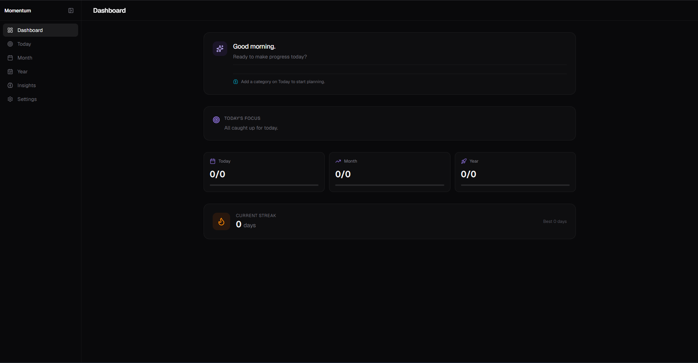
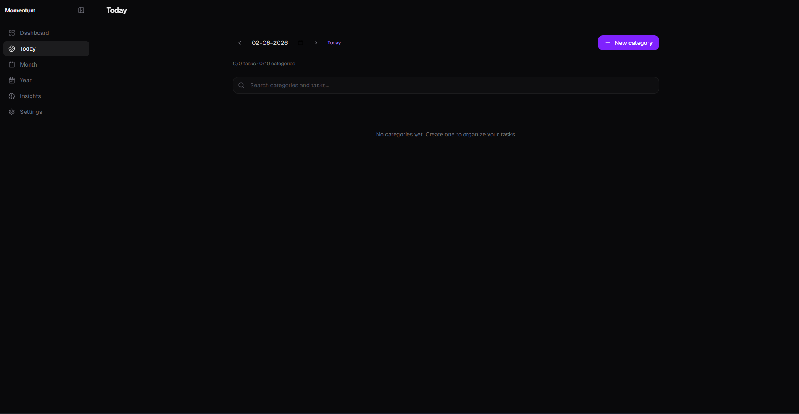
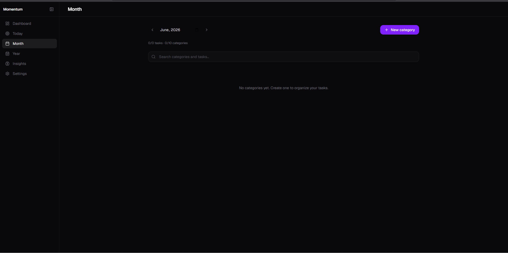
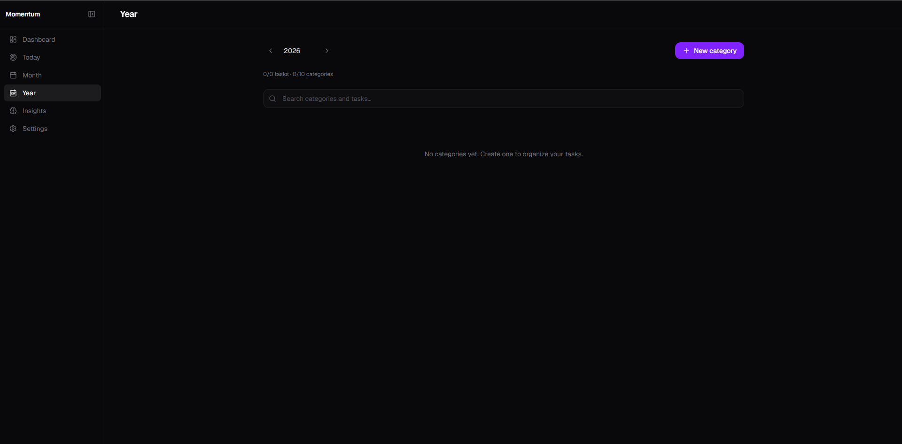
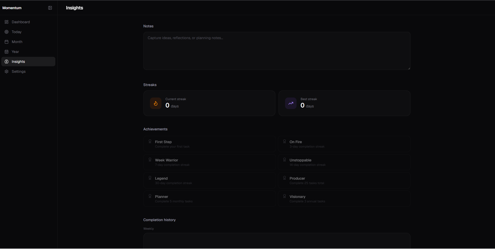

# Momentum OS

AI-powered productivity operating system for planning, execution, and personal growth.

## 🚀 Live Demo

https://momentum-os-eight.vercel.app

## ✨ Features

- Daily Planning
- Monthly Goals
- Yearly Roadmap
- Categories & Subtasks
- AI-Powered Summaries
- Productivity Insights
- Analytics Dashboard
- Responsive Design

## 🛠️ Tech Stack

- Next.js
- TypeScript
- Tailwind CSS
- Vercel

## 📊 Screenshots

### Dashboard

### Today Planning

### Month Planning

### Year Planning

### Insights

## 🎯 Roadmap

- User Authentication
- Cloud Database
- AI Recommendations
- Team Collaboration
- Mobile App

## 🔗 Links

Live App:
https://momentum-os-eight.vercel.app

GitHub:
https://github.com/ranbirbisht6/momentum-os
